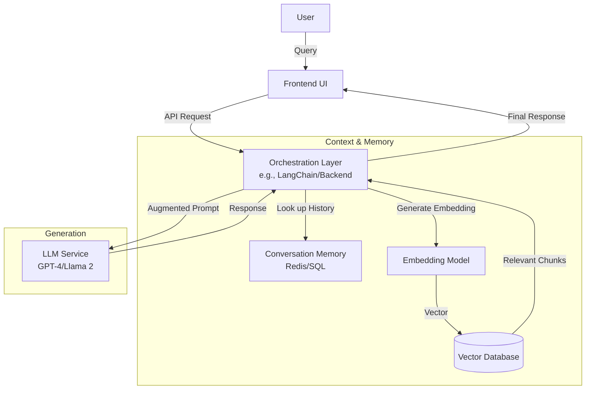

# Assignment 2 Responses

## 1. Self-Assessment
**Rating: A (Can code independently)**

I possess comprehensive knowledge and practical capabilities in LLMs, Deep Learning, AI, and ML. I can design, implement, and debug complex architectures, ranging from standard neural networks to advanced Retrieval-Augmented Generation (RAG) systems and agentic workflows, without supervision.

---

## 2. Key Architectural Components of an LLM-based Chatbot

Creating a robust LLM-based chatbot moves beyond simple API calls to a structured architecture that ensures context, accuracy, and scalability. The high-level approach typically follows the **Retrieval-Augmented Generation (RAG)** pattern.

### High-Level Approach
1.  **User Input**: The user sends a query via the frontend.
2.  **Orchestration & Transformation**: The query is intercepted by an orchestration layer (e.g., LangChain) which may reformulate it for better search results.
3.  **Retrieval (Semantic Search)**: The system converts the query into a vector embedding and searches a **Vector Database** for relevant context (documents, history).
4.  **Prompt Construction**: The retrieved context + the original user query + system instructions are combined into a coherent prompt.
5.  **LLM Generation**: The LLM infers a response based on this augmented prompt.
6.  **Memory & Guardrails**: The response is checked against safety guardrails, saved to conversation history (Memory), and sent back to the user.

### Architectural Diagram

### Key Components
| Component | Function | Example Technologies |
| :--- | :--- | :--- |
| **Frontend/Interface** | Captures user intent and renders responses. | React, Streamlit, Chainlit |
| **Orchestrator** | Manages the flow, calls tools, handles logic. | LangChain, LlamaIndex, Flowise |
| **Embedding Model** | Converts text to numerical vectors for machine understanding. | OpenAI text-embedding-3, HuggingFace Transformers |
| **Vector Database** | Stores embeddings for fast semantic retrieval. | Pinecone, Weaviate, Milvus |
| **LLM** | The "brain" that generates natural language text. | GPT-4o, Claude 3.5, Llama 3 |
| **Memory** | Stores past interactions to maintain context. | Redis, Postgres, DynamoDB |

---

## 3. Vector Databases

### Explanation
A **Vector Database** is a specialized database designed to store, manage, and index high-dimensional vectors. Unlike traditional relational databases (SQL) that match exact text, vector databases perform **similarity search** (often using algorithms like HNSW or Cosine Similarity). This allows the system to find data that is *semantically similar* to the query, even if the keywords don't match exactly.

### Hypothetical Problem: Legal Precedent & Contract Analysis System
**Problem**: A law firm has millions of PDF contracts and case files. Lawyers need to ask complex queries like *"Find cases where the force majeure clause was invoked due to supply chain disruption."*
*   **Challenge**: Keyword search fails because "supply chain disruption" might be phrased as "logistical failure" or "shipment delay" in the documents. The system implies a need for **Hybrid Search** (matching specific legal terms + conceptual meaning) and strict **Data Privacy/Tenancy**.

### Selected Database: Pinecone

**Choice**: I would choose **Pinecone** for this specific legal application.

**Why?**
1.  **Managed Serverless Infrastructure**: For a law firm or legal tech SaaS, the focus should be on application logic, not database maintenance. Pinecone's serverless architecture handles scaling automatically, ensuring fast retrieval even as the document complexity ranges from hundreds to millions of case files.
2.  **Hybrid Search (Sparse-Dense)**: Pinecone supports hybrid search (combining dense vector search with sparse keyword search via SPLADE/BM25). This is critical for legal queries where specific clauses ("Section 8.1") must be matched alongside semantic concepts ("breach of contract").
3.  **Metadata Filtering**: Legal discovery often processes constrained queries (e.g., "only contracts from 2023"). Pinecone's "Single-Stage Filtering" serves these filtered queries with high performance without post-processing overhead.

**Alternative**: If strict on-premise data residency was the absolute #1 hard requirement (e.g., air-gapped government systems), I might consider **Milvus** or **Weaviate** for self-hosting. However, for a modern, agile legal-tech solution, Pinecone's performance/ease-of-use trade-off is superior.
